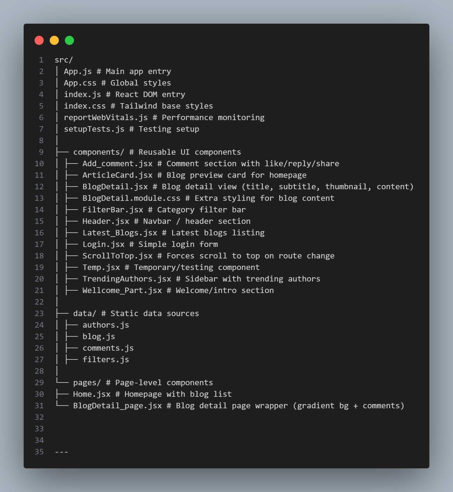

# 📝 Shabd-Setu Blog Platform

A modern, responsive blog platform built with **React**, **TailwindCSS**, and **React Router**.  
It features elegant blog detail pages, gradient backgrounds, interactive comments, and a clean card-based UI.

---

## 🚀 Features

- 📖 **Blog Listing & Detail Pages**  
  Browse blogs on the home page and view full details with thumbnail, subtitle, author info, and content.  

- 🎨 **Modern UI with TailwindCSS**  
  Responsive design with gradient backgrounds, smooth shadows, and frosted-glass effects.  

- 🖼️ **Dynamic Thumbnails**  
  Blog thumbnails are styled with a **16:9 aspect ratio** (like video screens) for consistency.  

- 💬 **Interactive Comments**  
  Add, like, reply, and share comments with live updates.  

- 🔄 **Smooth Navigation**  
  Uses `react-router-dom` for client-side routing and `ScrollToTop` utility to reset scroll on navigation.  

- 🌟 **Reusable Components**  
  Header, Blog cards, filters, trending authors, and more — built as modular React components.  

---

## 🛠️ Tech Stack

**Frontend**
- [React 19](https://react.dev/) — UI framework  
- [React Router v7](https://reactrouter.com/) — routing  
- [TailwindCSS 3](https://tailwindcss.com/) — utility-first CSS  
- [Lucide React](https://lucide.dev/) — icon set  
- [Motion](https://motion.dev/) — animations  

**Tooling**
- `react-scripts` — Create React App build scripts  
- `postcss`, `autoprefixer` — CSS processing  

**Testing**
- `@testing-library/react`, `@testing-library/jest-dom`, `@testing-library/dom`, `@testing-library/user-event`  

**Performance**
- `web-vitals` — Core Web Vitals metrics  

---

## 📂 Project Structure



## ⚙️ Setup & Installation

1. **Clone the repository**
   ```bash
   git clone https://github.com/your-username/shabd-setu.git
   cd shabd-setu
2. **Install dependencies**
    npm install
3. **Run the development server**
    npm start
4. **Open in browser:**
    http://localhost:3000


## 📸 Screenshots

1. **Home Page**
    
    
2. **Blog Detail page**
    
    
    